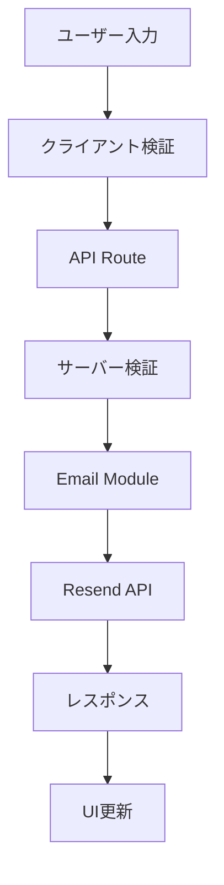

# システムアーキテクチャ

**作成日**: 2025年1月17日  
**プロジェクト**: DeepHand Web

## 概要

DeepHand Webは、手話認識AIソリューションを提供するWebアプリケーションです。Astro v5.9.3をベースとしたモダンなJAMstackアーキテクチャを採用し、パフォーマンスとメンテナビリティを両立しています。

## 技術スタック

### フロントエンド
- **Astro** v5.9.3 - メタフレームワーク、静的サイト生成
- **React** v19.1.0 - インタラクティブコンポーネント
- **TypeScript** - 型安全な開発
- **Tailwind CSS** v3.4.17 - ユーティリティファーストCSS
- **Framer Motion** - アニメーションライブラリ

### バックエンド・API
- **Astro API Routes** - サーバーサイド機能
- **Resend** - メール送信サービス
- **Zod** - スキーマ検証

### ツールチェーン
- **Vite** - 高速ビルドツール
- **Vitest** v3.2.3 - テストフレームワーク
- **ESLint** - 静的解析
- **Prettier** - コードフォーマッター

### インフラストラクチャ
- **Cloudflare Pages** - ホスティング・CDN
- **Node.js** 18+ - ランタイム環境

## プロジェクト構造

```
deephand-web/
├── src/
│   ├── components/          # Reactコンポーネント
│   │   ├── ui/             # 基本UIコンポーネント
│   │   ├── common/         # 共通コンポーネント
│   │   ├── features/       # 機能別コンポーネント
│   │   ├── forms/          # フォームコンポーネント
│   │   └── islands/        # Astro Islands
│   ├── layouts/            # レイアウトコンポーネント
│   ├── lib/                # ビジネスロジック・ユーティリティ
│   │   ├── __tests__/      # ライブラリテスト
│   │   ├── email/          # メール機能（モジュラー）
│   │   ├── animations/     # アニメーション設定
│   │   ├── performance/    # パフォーマンス最適化
│   │   └── security.ts     # セキュリティ機能
│   ├── pages/              # Astroページ・ルート
│   │   ├── api/            # APIエンドポイント
│   │   ├── index.astro     # ホームページ
│   │   └── request.astro   # データリクエストページ
│   ├── styles/             # グローバルスタイル
│   └── types/              # TypeScript型定義
├── public/                 # 静的アセット
│   ├── fonts/             # フォントファイル
│   ├── images/            # 画像ファイル
│   └── logo.png           # ロゴ
├── tests/                  # テストファイル
│   ├── refactoring/       # リファクタリングテスト
│   └── integration/       # 統合テスト
├── docs/                   # プロジェクトドキュメント
└── dist/                   # ビルド出力
```

## アーキテクチャパターン

### JAMstack アーキテクチャ
- **JavaScript**: クライアントサイドの動的機能
- **APIs**: サーバーサイド機能とサードパーティ統合
- **Markup**: 事前生成されたHTML

### Islands Architecture (Astro)
- **静的HTML**: SEOとパフォーマンスに最適化
- **部分的水和**: 必要な部分のみJavaScriptを配信
- **プログレッシブエンハンスメント**: 基本機能を保証

```astro
---
// ページレベル（サーバーサイドレンダリング）
const data = await fetchData();
---

<!-- 静的コンテンツ -->
<section>
  <h1>{data.title}</h1>
  <p>{data.description}</p>
</section>

<!-- インタラクティブコンポーネント -->
<ContactForm client:idle />      <!-- アイドル時に水和 -->
<HeroSection client:visible />   <!-- 表示時に水和 -->
<DataChart client:load />        <!-- 即座に水和 -->
```

## モジュラーアーキテクチャ

### Email モジュール
リファクタリングにより、単一の大きなファイル（772行）から責務ごとに分離されたモジュラー構造に変更：

```typescript
// src/lib/email/
├── index.ts          # エントリーポイント、型定義エクスポート
├── validation.ts     # 設定検証ロジック
├── sender.ts         # メール送信ロジック
└── templates.ts      # HTMLテンプレート生成
```

#### 各モジュールの責務

**validation.ts**
```typescript
export interface EmailValidation {
  isValid: boolean;
  errors: string[];
}

export interface EmailResult {
  success: boolean;
  messageId?: string;
  error?: string;
}

export function validateEmailConfig(): EmailValidation;
```

**sender.ts**
```typescript
export async function sendContactEmail(data: ContactFormData): Promise<EmailResult>;
export async function sendDataRequestEmail(data: DataRequestFormData): Promise<EmailResult>;
```

**templates.ts**
```typescript
export function generateContactEmailHtml(data: ContactFormData): string;
export function generateContactEmailText(data: ContactFormData): string;
export function generateDataRequestEmailHtml(data: DataRequestFormData): string;
export function generateDataRequestEmailText(data: DataRequestFormData): string;
```

**index.ts**
```typescript
// 統一されたエクスポート
export type { EmailResult, EmailValidation } from './validation';
export { validateEmailConfig } from './validation';
export { sendContactEmail, sendDataRequestEmail } from './sender';
export * from './templates';
```

## データフロー

### フォーム送信フロー


### コンポーネント間通信
```typescript
// 状態管理パターン
const ContactForm = () => {
  const [formState, setFormState] = useState({
    data: {},
    status: 'idle',
    errors: {}
  });

  const handleSubmit = async (formData) => {
    setFormState(prev => ({ ...prev, status: 'submitting' }));
    
    try {
      const response = await fetch('/api/contact', {
        method: 'POST',
        body: JSON.stringify(formData)
      });
      
      const result = await response.json();
      
      setFormState(prev => ({
        ...prev,
        status: result.success ? 'success' : 'error'
      }));
    } catch (error) {
      setFormState(prev => ({ ...prev, status: 'error' }));
    }
  };
};
```

## セキュリティアーキテクチャ

### 入力検証
```typescript
// 多層防御アプローチ
export const ContactFormSchema = z.object({
  name: z.string().min(2).max(100),
  email: z.string().email(),
  organization: z.string().optional(),
  message: z.string().min(10).max(1000)
});

// クライアント検証
const clientValidation = ContactFormSchema.safeParse(formData);

// サーバー検証
const serverValidation = ContactFormSchema.safeParse(requestData);
```

### CSRF保護
```typescript
// セキュリティミドルウェア
export const securityMiddleware = {
  validateRequest: (request: Request, context: SecurityContext) => {
    const method = request.method?.toUpperCase();
    
    if (['POST', 'PUT', 'DELETE', 'PATCH'].includes(method)) {
      const token = request.headers.get('x-csrf-token');
      const expectedToken = context.csrfToken;
      
      if (!validateCSRFToken(token || '', expectedToken || '')) {
        return { valid: false, reason: 'Invalid CSRF token' };
      }
    }
    
    return { valid: true };
  }
};
```

## パフォーマンスアーキテクチャ

### 静的生成 + 動的機能
```typescript
// ビルド時生成
export async function getStaticPaths() {
  return [
    { params: { page: 'index' } },
    { params: { page: 'request' } }
  ];
}

// 動的API
export async function POST({ request }: APIContext) {
  // リクエスト処理
}
```

### コード分割戦略
```typescript
// ページレベル分割
const HeroSection = lazy(() => import('@/components/HeroSection'));

// 機能レベル分割
const ChartComponent = lazy(() => import('@/components/charts/Chart'));

// ライブラリ分割
const animations = {
  loadFramerMotion: () => import('framer-motion'),
  loadChartLibrary: () => import('chart.js')
};
```

### バンドル最適化
```javascript
// vite.config.ts
export default defineConfig({
  build: {
    rollupOptions: {
      output: {
        manualChunks: {
          vendor: ['react', 'react-dom'],
          ui: ['framer-motion', '@radix-ui/react-slot'],
          utils: ['clsx', 'tailwind-merge'],
          email: ['./src/lib/email/index']
        }
      }
    }
  }
});
```

## エラーハンドリングアーキテクチャ

### 構造化ログシステム
```typescript
export interface ErrorContext {
  operation: string;
  timestamp: number;
  userId?: string;
  sessionId?: string;
  userAgent?: string;
  ip?: string;
  additional?: Record<string, any>;
}

export function logError(message: string, context: Partial<ErrorContext> = {}): ErrorLog {
  const errorLog = createErrorLog('error', message, context);
  
  if (ENV.NODE_ENV === 'development') {
    console.error(`[ERROR] ${message}`, context);
  }
  
  // 本番環境では外部ログサービスに送信
  if (ENV.NODE_ENV === 'production') {
    sendToExternalLogging(errorLog);
  }
  
  return errorLog;
}
```

### フォールバック戦略
```typescript
// API フォールバック
export async function sendEmailWithFallback(data: EmailData) {
  try {
    return await sendEmail(data);
  } catch (error) {
    logError('Primary email service failed', { error: error.message });
    
    // フォールバックメール送信
    try {
      return await sendEmailViaBackup(data);
    } catch (backupError) {
      logError('Backup email service failed', { error: backupError.message });
      throw new Error('All email services unavailable');
    }
  }
}
```

## テストアーキテクチャ

### テスト戦略
```typescript
// テストピラミッド
export const TestStrategy = {
  unit: {
    // ユーティリティ関数、個別コンポーネント
    tools: ['Vitest', '@testing-library/react'],
    coverage: '>= 80%'
  },
  
  integration: {
    // API統合、コンポーネント組み合わせ
    tools: ['Vitest', 'MSW'],
    coverage: '>= 60%'
  },
  
  e2e: {
    // ユーザーフロー全体
    tools: ['Playwright'],
    coverage: '主要ユーザーフロー'
  },
  
  performance: {
    // パフォーマンス回帰
    tools: ['Lighthouse CI', 'WebPageTest'],
    metrics: 'Core Web Vitals'
  }
};
```

### TDDワークフロー
```typescript
// Phase-driven リファクタリング
export const RefactoringPhases = {
  phase1: 'ファイルクリーンアップ',
  phase2: 'コンポーネント構造統一',
  phase3: 'コード分割・最適化',
  phase4: '型安全性向上',
  phase5: 'テストカバレッジ拡充',
  phase6: 'ドキュメンテーション'
};
```

## デプロイメントアーキテクチャ

### Cloudflare Pages
```yaml
# ビルド設定
build:
  command: npm run build
  output: dist
  environment:
    NODE_VERSION: 18
    NPM_CONFIG_PRODUCTION: false

# 環境変数
environment:
  RESEND_API_KEY: ${{ secrets.RESEND_API_KEY }}
  ADMIN_EMAIL: ${{ secrets.ADMIN_EMAIL }}
  PUBLIC_SITE_URL: https://deephand.example.com
```

### CI/CD パイプライン
```yaml
# .github/workflows/deploy.yml
name: Deploy to Cloudflare Pages

on:
  push:
    branches: [main]
  pull_request:
    branches: [main]

jobs:
  test:
    runs-on: ubuntu-latest
    steps:
      - uses: actions/checkout@v3
      - uses: actions/setup-node@v3
        with:
          node-version: '18'
      - run: npm ci
      - run: npm run test
      - run: npm run typecheck
      - run: npm run lint

  build-and-deploy:
    needs: test
    runs-on: ubuntu-latest
    steps:
      - uses: actions/checkout@v3
      - run: npm ci
      - run: npm run build
      - uses: cloudflare/pages-action@v1
        with:
          apiToken: ${{ secrets.CLOUDFLARE_API_TOKEN }}
          accountId: ${{ secrets.CLOUDFLARE_ACCOUNT_ID }}
          projectName: deephand-web
          directory: dist
```

## 拡張性とメンテナビリティ

### モジュール設計原則
1. **単一責任原則**: 各モジュールは単一の責務を持つ
2. **開放閉鎖原則**: 拡張に開放、修正に閉鎖
3. **依存関係逆転**: 抽象に依存、具象に依存しない
4. **インターフェース分離**: 必要な機能のみを公開

### 将来の拡張計画
```typescript
// プラグインアーキテクチャ
export interface Plugin {
  name: string;
  version: string;
  init: (config: PluginConfig) => Promise<void>;
  destroy: () => Promise<void>;
}

// マイクロサービス統合
export interface ServiceAdapter {
  authenticate: (credentials: Credentials) => Promise<AuthResult>;
  sendRequest: (endpoint: string, data: any) => Promise<ApiResponse>;
  handleError: (error: ServiceError) => void;
}
```

## パフォーマンス監視

### メトリクス収集
```typescript
// Web Vitals監視
export const PerformanceMonitoring = {
  trackWebVitals: () => {
    import('web-vitals').then(({ getCLS, getFID, getFCP, getLCP, getTTFB }) => {
      getCLS(sendToAnalytics);
      getFID(sendToAnalytics);
      getFCP(sendToAnalytics);
      getLCP(sendToAnalytics);
      getTTFB(sendToAnalytics);
    });
  },
  
  trackCustomMetrics: (name: string, value: number) => {
    performance.mark(`${name}-start`);
    // 処理実行
    performance.mark(`${name}-end`);
    performance.measure(name, `${name}-start`, `${name}-end`);
  }
};
```

## 今後の技術的課題

### 短期（3ヶ月）
1. Service Worker実装によるオフライン対応
2. 画像最適化の自動化
3. API レスポンス時間の最適化

### 中期（6ヶ月）
1. マイクロフロントエンド移行の検討
2. GraphQL APIの導入
3. リアルタイム機能の追加

### 長期（1年）
1. PWA対応の完全実装
2. Edge Computing活用
3. AI機能の直接統合

---

このアーキテクチャドキュメントは、プロジェクトの成長と技術の進歩に合わせて継続的に更新されます。新しい技術的決定や大きな変更がある場合は、このドキュメントを更新し、チーム全体で共有してください。